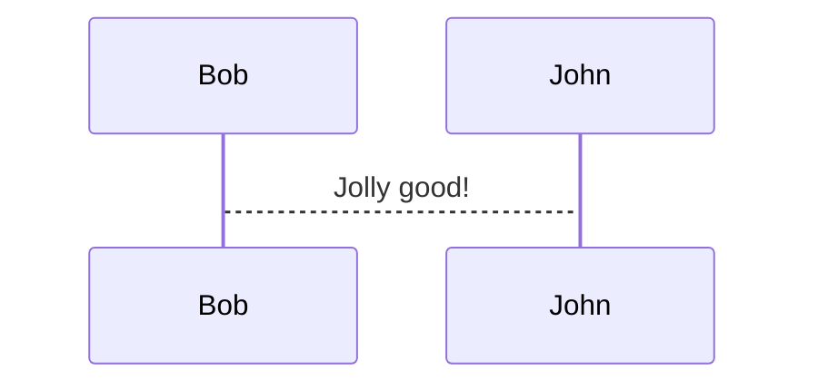
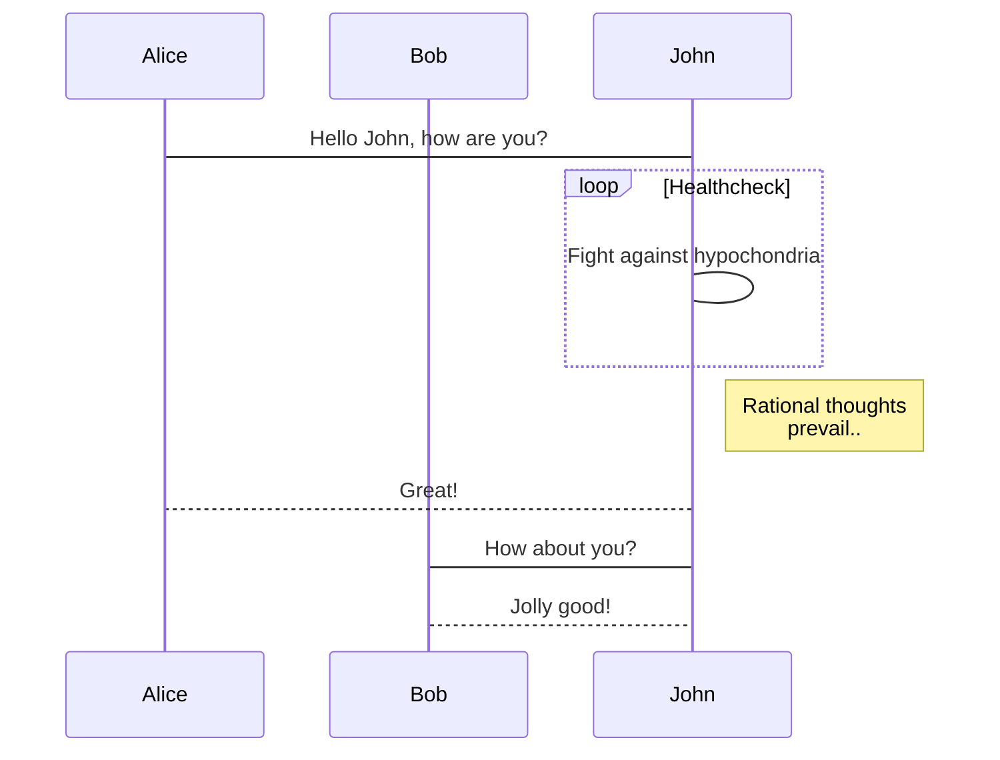

# 项目章程

## 第一节

## 第1节

### 的d额

```mermaid
sequenceDiagram
    participant Bob
    participant John
    Bob-->John: Jolly good!
```

```mermaid
sequenceDiagram
    participant Alice
    participant Bob
    participant John
    
    Alice->John: Hello John, how are you?
    loop Healthcheck
        John->John: Fight against hypochondria
    end
    Note right of John: Rational thoughts <br/>prevail..
    John-->Alice: Great!
    John->Bob: How about you?
    Bob-->John: Jolly good!
```
